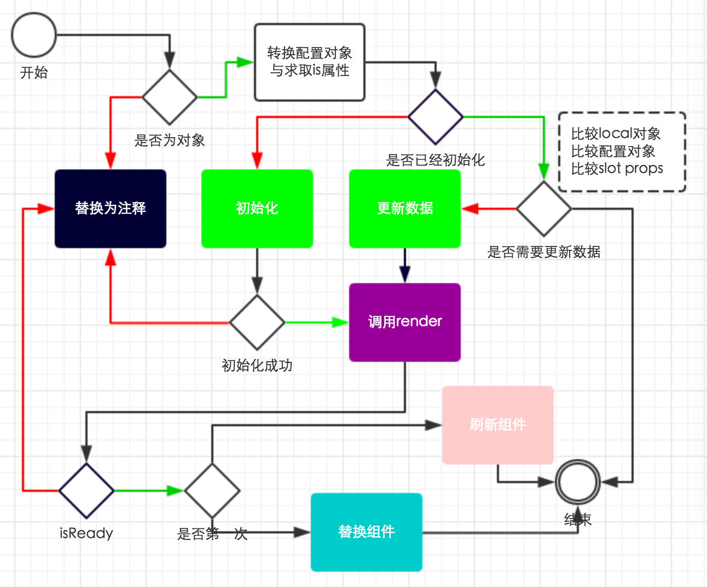

ms-widget的文档
====================
avalon1.4是使用ms-widget属性实现组件的

avalon1.5是使用自定义标签来实现组件的

avalon1.6没有完成相关的探索

avalon2的组件是基于avalon1.4与1.5的基础上构建的

avalon2提出了一个叫**组件容器**的概念, 只有组件容器才能变成组件.

组件容器是用来占位与传参.

占位的功能比较好理解,就是新生成的组件会替换原元素.

传参的功能,是指avalon会将原元素的nodeName,所有属性值,及元素的innerHTML作为传参, 传入组件的渲染函数
生成组件的虚拟DOM,从而进一步转换真实DOM(组件),替换原元素


只有wbr, xmp, template及以ms-开头的标签才能成为组件容器, 否则收到一个警告

但组件容器不是一定能转换成一个组件.

ms-开头的标签可以用nodeName来声明组件的身份,是要变成一个panel呢,还是一个treeview.

对于wbr, xmp, template则需要is属性或ms-widget属性声明组件的身份

但avalon只建议用wbr, xmp, template及以ms-开头的标签做组件，否则会收到一个警告

```html
<xmp is="ms-button"></xmp>
<xmp ms-widget='{is:"ms-button"}'></xmp>
```

但我们知道组件的身份, 那么我们就要用is到avalon.components中取对应的组件

```javascript
    var definition = avalon.components[is]
    if (!definition) {
        avalon.warn(is + '组件还没有加载')
        return
    }
```


如果你想在页面上使用ms-button组件，只能用于以下四种方式

```html
<ms-button></ms-button>
<xmp is="ms-button"></xmp>
<wbr is="ms-button"/>
<template is="ms-button"></template>

```

当然使用ms-widget可以传入更多配置项
```html
<xmp is="ms-button" ms-widget="{aaa: 1, bbb:@ddd}"></xmp>
<xmp ms-widget="{is:"ms-button", aaa: 1, bbb:@ddd}"></xmp>
```


但在IE6－8下，ms-button与template会解析出错，只能用xmp,wbr这两个元素。因此我强烈建议，除非组件的内部还包含 组件的情况，我们只用以下两种写法：

```html
<xmp ms-widget='{is:"ms-button"}'></xmp>
<wbr ms-widget='{is:"ms-button"}'/>

```

template在IE9下认为是一个XML元素，并且HTML5元素。

如果组件套组件可以这么玩

```html
<xmp ms-widget='{is:"ms-panel"}'>
    <ms-tabs ms-widget="@tabsConfig">
      <div slot='tab'>xxxxx</div>
      <div slot='tab'>xxxxx</div>
      <div slot='tab'>xxxxx</div>
      <p><ms-button /></p>
    </ms-tabs>
</xmp>

```
xmp为一个普通标签，与DIV一样，里面可以套其他元素，但它不会将它们都转换元素节点，里面只有一个文本节点，因此你想怎么写也行，如ms-button，本来你要`<ms-button></ms-button>`这样的写，现在半闭合就行了。

自定义标签只是为组件提供了一个is配置项，更多的配置项在ms-widget中。在1.4里，那是一个字符串，现在它是一个对象或一个对象数组。以前我们要操作组件非常困难，必须等到组件生成后，通过onInit这个回调才能得到组件vm。现在强烈建议，ms-widget为vm中一个子vm对象。

```javascript
avalon.define({
    $id: 'test',
    xxx: {buttonText:'aaa'}
})

<xmp ms-widget='[{is:"ms-button"}, @xxx]'></xmp>

```

那么就会生成

```html
<button type="button"><span>aaa</span></button>
```


然后 我们直接将改vm.xxx.buttonText = "333",视图就会立即变成

```html
<button type="button"><span>333</span></button>
```

当然，由于我们已经在ms-widget上传入足够 的配置，那么xmp的innerHTML对我们就没有用，因此也可以简化成

```javascript
avalon.define({
    $id: 'test',
    xxx: {buttonText:'aaa'}
})

<wbr ms-widget='[{is:"ms-button"}, @xxx]'/>

```

wbr的行为有点像br元素，用于软换行的


好了，我们看一下ms-widget能传入什么东西。

1. is, 指定组件的类型
2. id, 新生成的组件vm的$id
3. onInit， 当组件的vm生成后触发的回调（只会执行一次）
4. onReady，当组件插入DOM树且其内部子组件也可使时，就会触发的回调（只会执行一次）
5. onViewChange，当组件的outerHTML 发生变化，就会触发的回调
6. onDispose，当组件除出DOM树时，就会触发的回调（只会执行一次）
7. 其他你想传入的配置项。。。。

此外，avalon2还支持Web Components规范中所说的slot插入点机制，它是用来配置
一些字符串长度很长的属性。比如说ms-tabs组件，通常有一个数组属性，
而数组的每个元素都是一个很长的文本，用于以应一个面板。这时我们可以在自定义标签的
innerHTML内，添加一些slot元素，并且指定其name就行了。

当我们不使用slot，又不愿意写面板内部放进vm时，你的页面会是这样的：

```html
<ms-tabs ms-widget='{panels:[
"第一个面板的内部dfsdfsdfsdfdsfdsf",
"第二个面板的内部dfsdfsdfsdfdsfdsf"
"第三个面板的内部dfsdfsdfsdfdsfdsf"]  }'
></ms-tabs>
```

使用了slot后

```html
<ms-tabs>
<div slot='panels'>第一个面板的内部dfsdfsdfsdfdsfdsf</div>
<div slot='panels'>第二个面板的内部dfsdfsdfsdfdsfdsf</div>
<div slot='panels'>第三个面板的内部dfsdfsdfsdfdsfdsf</div>
</ms-tabs>
```


而你的组件是这样定义

```html
<ms-tabs>
<slot name='panels'></solt>
<slot name='panels'></solt>
<slot name='panels'></solt>
</ms-tabs>

```

上面的div会依次替代slot元素。


此外，如果我们只有一个插槽，不想在页面上slot属性，那么可以在组件里使用soleSlot

我们可以看一下ms-button是怎么使用的

```javascript
avalon.component('ms-button', {
    template: '<button type="button"><span><slot name="buttonText"></slot></span></button>',
    defaults: {
        buttonText: "button"
    },
    soleSlot: 'buttonText'
})

```
注意avalon.component的第二个参数，至少要有template属性。

组件属性的寻找顺序，会优先找配置对象，然后是innerHTML，然后是defaults中的默认值.我们可以看一下测试

```javascript
div.innerHTML = heredoc(function () {
            /*
             <div ms-controller='widget0' >
             <xmp ms-widget="{is:'ms-button'}">{{@btn}}</xmp>
             <ms-button>这是标签里面的TEXT</ms-button>
             <ms-button ms-widget='{buttonText:"这是属性中的TEXT"}'></ms-button>
             <ms-button></ms-button>
             </div>
             */
        })
        vm = avalon.define({
            $id: 'widget0',
            btn: '这是VM中的TEXT'
        })
        avalon.scan(div)
        setTimeout(function () {
            var span = div.getElementsByTagName('span')
            expect(span[0].innerHTML).to.equal('这是VM中的TEXT')
            expect(span[1].innerHTML).to.equal('这是标签里面的TEXT')
            expect(span[2].innerHTML).to.equal('这是属性中的TEXT')
            expect(span[3].innerHTML).to.equal('button')
            vm.btn = '改动'
            setTimeout(function () {
                expect(span[0].innerHTML).to.equal('改动')
                done()
            })
        })

```

生命周期回调的例子.
avalon是使用多种策略来监听元素是否移除

```html
<!DOCTYPE html>
<html>
    <head>
        <title>TODO supply a title</title>
        <meta charset="UTF-8">
        <meta name="viewport" content="width=device-width, initial-scale=1.0">
        <script src="./dist/avalon.js"></script>
        <script>

            var vm = avalon.define({
                $id: 'widget0',
                config: {
                    buttonText: '按钮',
                    onInit: function (a) {
                        console.log("onInit!!")
                    },
                    onReady: function (a) {
                        console.log("onReady!!")
                    },
                    onViewChange: function () {
                        console.log("onViewChange!!")
                    },
                    onDispose: function () {
                        console.log("onDispose!!")
                    }
                }
            })
            setTimeout(function () {
                vm.config.buttonText = 'change'
                setTimeout(function () {
                    document.body.innerHTML = ""
                }, 1000)
            }, 1000)

        </script>
    </head>

    <body>
        <div ms-controller='widget0' >
            <div><wbr ms-widget="[{is:'ms-button'},@config]"/></div>
        </div>
    </body>
</html>
```



 