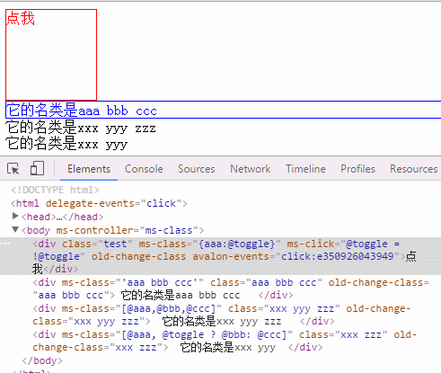
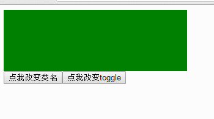
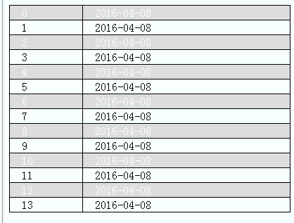

### 07 类名操作
### 07 Classname Operation

> https://segmentfault.com/a/1190000004894518
 
avalon2的类名操作涉及到ms-class,ms-active,ms-hover，但用法也全变了，行为类似于前两节说的ms-attr,ms-css，目的是将相同行为集中在一起定义。

Avalon2 class name operation involves `ms-class, ms-active, ms-hover`,but the usage has changed, similar to the behavior of the previous two `ms-attr, ms-css`, the purpose is to put together the same behavior definition.

由于ms-class,ms-active, ms-hover语法很相似，我们就以ms-class为例吧。ms-class可以对应vm中的一个字符串属性，里面可以有空格（一个空格就是一个类名嘛）

Because of `ms-class, ms-active, ms-hover` syntax is very similar, we take a example of `ms-class`.`ms-class` can be a string attribute in the corresponding VM, which can be a space (a space is a classname.)

		
	vm.classes = "aaa bbb ccc"
	

	
显然这不够灵活，我们有时需要在某个场合添加某类名，到另一个场合就要移除它。于是从我们React的classSet与Classnames插件中涉取灵感，让它支持更复杂的数据型。比如布尔对象（键名为类名，值为布尔的对象，值决定是否添加与移除），还有一维数组，里面可以是null, 字符串，布尔，布尔对象，我会根据其真假值或布尔对象的值的真假，合并成一组类名。

Obviously this is not flexible enough, we sometimes need to add a class name on certain occasions, it is necessary to remove it to another occasion. So from our React ClassIn and Classnames plug-ins involved in the inspiration, it supports more complex data type. Such as Boolean objects (key name for the class name, the value of Boolean objects, the value of whether to add and remove), there is a one-dimensional array, which can be null, string, Boolean, Boolean objects, Or Boolean object values ​​are true and false, combined into a group of class names.

> 以下安利一下React的Classnames插件:
	Classnames plug-ins:
	https://github.com/JedWatson/classnames
	
	classNames('foo', 'bar'); // => 'foo bar'
	classNames('foo', { bar: true }); // => 'foo bar'
	classNames({ 'foo-bar': true }); // => 'foo-bar'
	classNames({ 'foo-bar': false }); // => ''
	classNames({ foo: true }, { bar: true }); // => 'foo bar'
	classNames({ foo: true, bar: true }); // => 'foo bar'
	
	// lots of arguments of various types
	classNames('foo', { bar: true, duck: false }, 'baz', { quux: true }); // => 'foo bar baz quux'
	
	// other falsy values are just ignored
	classNames(null, false, 'bar', undefined, 0, 1, { baz: null }, ''); // => 'bar 1'
	

avalon2则是这样用的

Avalon2 is used in this way

	

	
如果还不明白，可以翻看avalon2的源码，ms-class的自由度之高，绝对不逊于1.*的新旧风格！

If you do not understand, can look at the source code of avalon2 ms-class, the high degree of freedom, definitely not inferior to old style 1.*!

	<!DOCTYPE html>
		<html>
		    <head>
		        <title>New Style</title>
		        <meta charset="UTF-8">
		        <meta name="viewport" content="width=device-width">
		        
		        
		        
		    </head>
		    <body ms-controller="ms-class">
		        
点我

		        
 它的类名是 aaa bbb ccc   

		        
  它的类名是 xxx yyy zzz   

		        
  它的类名是 xxx yyy  

		    </body>
		</html>
	

	<!DOCTYPE html>
		<html>
		    <head>
		        <title>ms-class</title>
		        <meta http-equiv="Content-Type" content="text/html; charset=UTF-8">
		        
		        
		        
		    </head>
		    <body ms-controller="test" class="ms-class">
		        
测试:active

		        
测试:hover

		        

		            类名通过插值表达式生成 
		            {{@w}} * {{@h}} 
		            <input  ms-duplex="@h | change">
		        

		        
<button type="button" ms-class="'test'+@num" ms-click="@changeClassName">{{@className}}</button>

		    </body>
		</html>
		

	<!DOCTYPE html>
		<html>
		    <head>
		        <meta charset="UTF-8">
		        <meta name="viewport" content="width=device-width">
		        
		        
		        
		    </head>
		    <body ms-controller="test">
		        
 

		        <button ms-click="@switchColor"> 点我改变类名</button>
		        <button ms-click="@toggle = !@toggle"> 点我改变toggle</button>
		    </body>
		</html>
		

ms-class、 ms-hover、 ms-active涵盖了所有与类名相应的需求，并且使用上比jQuery还简单。最后看一下用它实现斑马线的效果吧。
	
`ms-class、 ms-hover、 ms-active` covers all the requirements corresponding to the class name, and the use of more simple than jQuery. Finally look at the effect of using it to achieve zebra crossing.

		<!DOCTYPE html>
		<html>
		    <head>
		        <title>ms-class</title>
		        <meta charset="UTF-8">
		        <meta name="viewport" content="width=device-width">
		        
		        
		        
		    </head>
		    <body ms-controller="test" >
		        <table class="zebra-table">
		            <tr ms-for="($index, el ) in @array" ms-hover="'hover'" ms-class="{even: $index % 2 == 0}">
		                <td>{{$index}}</td>
		                <td>{{ new Date - 0 | date("yyyy-MM-dd")}}</td>
		            </tr>
		        </table>
		    </body>
		</html>
		
