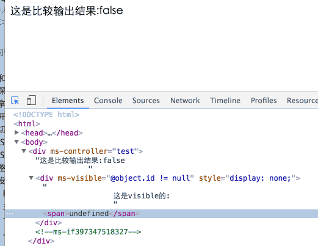
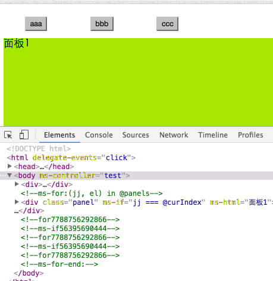

### 08 插入移除操作
### 08 Insert Removal operation

> https://segmentfault.com/a/1190000004896630

本节介绍的ms-if指令与ms-visible很相似，都是让某元素“看不见”，不同的是ms-visible是通过CSS实现，ms-if是通过移除插入节点实现。

This section describes the `ms-if` command and `ms-visible` is very similar, are to make an element "invisible", the difference is that `ms-visible` is achieved through the CSS, `ms-if` is to remove the insert node.

ms-if的用法与1.×时别无二致，只要值是真，就插入，为假时，就在原位置上替换为一个注释节点做占位符。

The use of `ms-if` and 1. × no different, as long as the value is true to insert, when false, in the original location to replace a node to do a placeholder comment.

> 注意： 在avalon1.*中，存在一个叫ms-if-loop的辅助指令，这个在2.0移除了，这个直接使用filterBy过滤器就能实现相似功能。

>Note: In avalon1. *, There is a helper instruction called `ms-if-loop`, which is removed in 2.0. This is done using filterBy filters.

	<!DOCTYPE HTML>
		<html>
		    <head>
		        <title>ms-if</title>
		        <meta http-equiv="Content-Type" content="text/html; charset=UTF-8">
		        
		        
		    </head>
		    <body>
		        

		            这是比较输出结果:{{@object.id != null}}
		            

		                这是visible的:
		                {{@object.message}}
		            

		            

		                这是if的:
		                {{@object.message}}
		            

		        

		    </body>
		</html>

现在我们用ms-if重新做一下切换卡吧

Now we use `ms-if` to do something to switch cards

	<!DOCTYPE html>
	<html>
	    <head>
	        <title>ms-if</title>
	        <meta charset="UTF-8">
	        <meta name="viewport" content="width=device-width">
	        
	        
	        
	    </head>
	    <body ms-controller="test" >
	        

	            <button ms-for='(i, el) in @buttons' ms-click='@curIndex = i'>{{el}}</button>
	        

	        

	    </body>
	</html>

