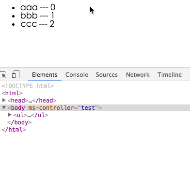

### 09 循环操作
### 09 Loop operation

>https://segmentfault.com/a/1190000004908426

avalon2的循环指令的用法完全改变了。avalon最早期从knockout那样抄来ms-each,ms-with，分别用于数组循环与对象循环。它们都是针对元素内容进行循环。后来又从angular那里抄来了ms-repeat， 这是循环元素内部的。

The use of the loop directive for avalon2 has changed completely. Avalon earliest from the knockout copied to `ms-each, ms-with`, respectively, for the array loop and object loop. They are for the elements of the content cycle. Later, from the angular copied to the `ms-repeat`, which is the internal elements of the cycle.

到avalon2，这三个指令合并成一个ms-for指令 ，用法与angular更相似，但没有$index, $last, $first, $middle.

To avalon2, these three instructions are merged into an ms-for command that is more similar to angular, but not `$index`, `$last`, `$first`, `$middle`.

如果想得到数组元素或对象的键值，在in关键字前指定一个新变量

If you want to get an array element or object key value, specify a new variable before the `in` keyword

	
{{el}}

如果要指定数组索引值或对象的键名，那么需要加一个小括号

If you want to specify the array index value or the key name of the object, you need to add a parenthesis

	
{{el}}

	
我们可以用limitBy, filterBy， orderBy, selectBy过滤器生成新的循环体

We can use the `limitBy`, `filterBy`, `orderBy`, `selectBy` filter to generate a new loop body

	
{{el}}

	
如果用limitBy过滤器，那么数组的长度或对象的大小会变小，那我们现在就不知道现在的长度，因此我们需要另一个变量引用新对象新数组

If we use the `limitBy` filter, then the length of the array or the size of the object will become smaller, then we now do not know the length, so we need another variable reference new object array

	
{{el}}::{{newArray.length}}

如果想实现之前的$fist, $last效果，那就需要用到js指令

If you want to achieve before the `$fist`, `$last` effect, it needs to use js instructions

		

			<!--ms-js:var $first = $index === 0 -->
			<!--ms-js:var $last = $index === new Array -2 -->
		

	

这是我们第一次见到以注释节点存在的指令了。实质上，ms-if的值为false，创建的注释节点也算是一种注释指令。

而avalon2是没有像angular那样的ng-repeat-start, ng-repeat-end这样圈 定某个范围的辅助指令。换言之，不能像ms-repeat那样循环多个元素。

这时我们需要了解一下其内部机制。这个以元素属性存在的ms-for指令，会翻译成以注释节点存在的ms-for指令。

This is the first time we have seen the existence of instructions to note the node. In essence, the value of `ms-if` is false, and the comment node created is a commented instruction.

And avalon2 is not as angular as the `ng-repeat-start`, `ng-repeat-end` this delineation of a range of auxiliary instructions. In other words, you can not loop multiple elements like `ms-repeat`.

At this point we need to understand its internal mechanisms. This ms-for directive, which exists as an element attribute, is translated into an `ms-for` instruction that exists as an annotation node.

	
{{el}}::{{$index}}

	
等价于

Equivalent to

	<!--ms-for:($index,el) in @array-->
	
{{el}}::{{$index}}

	<!--ms-for-end:-->
	
这有点复杂，但可以解决我们循环多个元素的问题

This is a little complicated, but it can solve the problem of looping multiple elements

	<!--ms-for:($index,el) in @array-->
	<td>{{el.td1}}</td>
	<td>{{el.td2}}</td>
	<!--ms-for-end:-->
	
	
>注意，avalon2的监控数组已经移除size()方法，由于内部使用了虚拟DOM，你直接使用@array.length就能得知道当前长度了。

>Note that the avalon2 monitor array has removed the `size()` method, and because of the internal use of the virtual DOM, you can use `@array.length` to know the current length.

>avalon2也没有angular的track by机制，或像React那样强制使用key.这种为优化排序性能的方法，avalon内部帮你搞定，就不需要你多写什么了。

>Avalon2 no angular track by mechanism, or as React as mandatory use key. This sort of performance optimization methods, avalon internal help you get, you do not need to write anything.

	<!DOCTYPE html>
	<html>
	    <head>
	        <meta http-equiv="Content-Type" content="text/html; charset=UTF-8">
	        
	        
	    </head>
	    <body ms-controller="test">
	        <ul>
	            <li ms-for="($index, el) in @array">{{el}} --- {{$index}}</li>
	        </ul>
	    </body>
	</html>
	

我们再来看一下如何循环二维数组

Let us look at how to cycle two-dimensional array

	<!DOCTYPE html>
	<html>
	    <head>
	        <meta http-equiv="Content-Type" content="text/html; charset=UTF-8">
	        
	        
	    </head>
	    <body ms-controller="test">
	        <table border="1">
	            <tr ms-for="($index, el) in @array">
	                <td ms-for="elem in el">{{elem}}  它位于第<b style="color:orchid">{{$index}}</b>行</td>
	            </tr>
	        </table>
	    </body>
	</html>
	

释节点，你用过angular也会发现类似的东西，这是方便框架对这些元素进行排序增删操作设计的。大家不要手动移除它们。

我们再看一个经典的例子，如何通过操作数组为列表添加或移除某一项！另，大家也可以对照这里看看avalon1是怎么实现的，你就明白avalon2在这方面的巨大优势与便利。

Release node, you will also find similar things used angular, which is convenient for these elements of the framework of the order of additions and deletions designed. Do not manually remove them.

Let us look at a classic example of how to manipulate the array for the list to add or remove an item! In addition, we can also control here to see how avalon1 is achieved, you will understand avalon2 great advantage in this area and convenience.

	
	<!DOCTYPE HTML>
	<html>
	    <head>
	        <title>ms-repeat</title>
	        <meta http-equiv="Content-Type" content="text/html; charset=UTF-8">
	        
	        
	    </head>
	    <body ms-controller="test">
	        
监控数组拥有以下方法，我们可以操作它们就能同步对应的区域

	        <blockquote>
	            push, shift, unshift, pop, slice, splice, remove, removeAt, removeAll, clear,
	            ensure, pushArray, sort, reverse, set
	        </blockquote>
	        <ul>
	            <li ms-for="($index,el) in @array">数组的第{{$index+1}}个元素为{{el}}</li>
	        </ul>
	        
对数组进行push操作，并回车<input ms-keypress="@push | enter">

	        
对数组进行unshift操作，并回车<input ms-keypress="@unshift | enter">

	        
对数组进行ensure操作，并回车<input ms-keypress="@ensure | enter"> 
	            (只有数组不存在此元素才push进去)

	        
对数组进行remove操作，并回车<input ms-keypress="@remove | enter">

	        
对数组进行removeAt操作，并回车<input ms-keypress="@removeAt | enter">

	        
<button type='button' ms-click="@sort">对数组进行sort操作</button>

	        
<button type='button' ms-click="@reverse">对数组进行reverse操作</button>

	        
<button type='button' ms-click="@shift">对数组进行shift操作</button>

	        
<button type='button' ms-click="@pop">对数组进行pop操作</button>

	        
当前数组的长度为{{@array.length}}。

	
	    </body>
	</html>
	

最后我们来一个表格的实用例子。之前avalon的大表格渲染时存在性能问题，现在大大得到改进了。

Finally, we come to a practical example of the form. Before avalon large table rendering performance problems, and now greatly improved.

	<!DOCTYPE html>
	<html>
	    <head>
	        <title>TODO supply a title</title>
	        <meta charset="UTF-8">
	        <meta name="viewport" content="width=device-width, initial-scale=1.0">
	        
	        
	    </head>
	    <body>
	
	        

	            <table border="1">
	                <tr><th ms-for='el in @header'>{{el}}</th></tr>
	               <tr ms-for='tr in @list'>
	                    <td ms-for='td in tr | selectBy(["name","age","sex"])' ms-attr="{align:td === 'age' ?'left':'right'}">{{td}}</td>
	                </tr>
	            </table>
	        

	    </body>
	</html>

